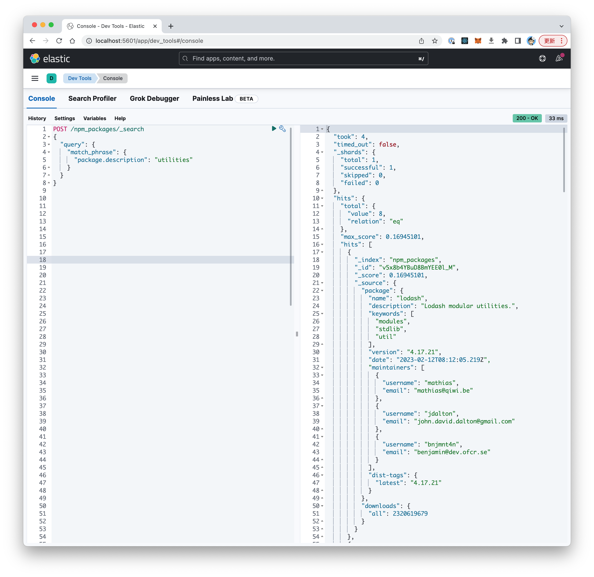
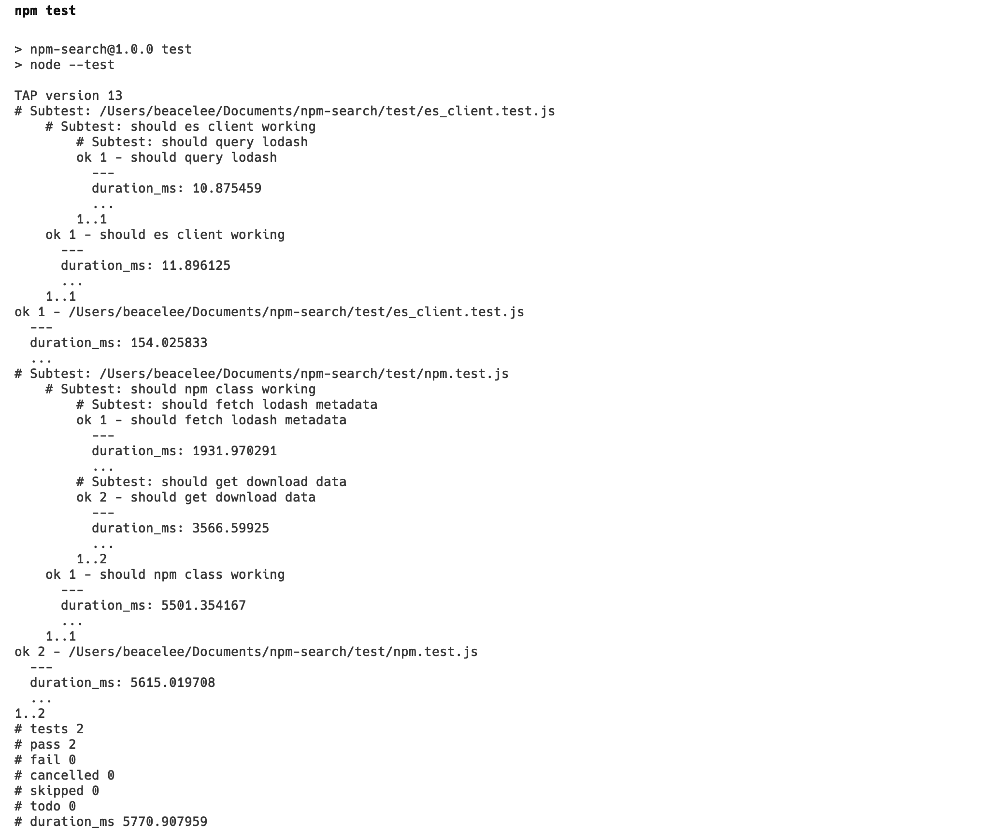

# npm search

A search solution for npm packages，power by [download elasticsearch](https://www.elastic.co/cn/downloads/elasticsearch).



## how to start(develop)

### required
- [download elasticsearch](https://www.elastic.co/cn/downloads/elasticsearch)
- [download kibana](https://www.elastic.co/cn/downloads/kibana)
- Node.js v18

### add config

edit `config/elasticsearch.yml`

```
vi config/elasticsearch.yml
```

modify the default config


```yaml
# ======================== Elasticsearch Configuration =========================
#
# NOTE: Elasticsearch comes with reasonable defaults for most settings.
#       Before you set out to tweak and tune the configuration, make sure you
#       understand what are you trying to accomplish and the consequences.
#
# ----------------------------------- Paths ------------------------------------
#
# Path to directory where to store the data (separate multiple locations by comma):
#
path.data: ./data
#
# Path to log files:
#
path.logs: ./logs
#
# ---------------------------------- Network -----------------------------------
#
# By default Elasticsearch is only accessible on localhost. Set a different
# address here to expose this node on the network:
#
network.host: 0.0.0.0
#
# By default Elasticsearch listens for HTTP traffic on the first free port it
# finds starting at 9200. Set a specific HTTP port here:
#
#http.port: 9200
#
# For more information, consult the network module documentation.
#
#----------------------- BEGIN SECURITY AUTO CONFIGURATION -----------------------
#
# The following settings, TLS certificates, and keys have been automatically
# generated to configure Elasticsearch security features on 11-02-2023 10:18:30
#
# --------------------------------------------------------------------------------

# Enable security features
xpack.security.enabled: false

xpack.security.enrollment.enabled: true

# Enable encryption for HTTP API client connections, such as Kibana, Logstash, and Agents
xpack.security.http.ssl:
  enabled: true
  keystore.path: certs/http.p12

# Enable encryption and mutual authentication between cluster nodes
xpack.security.transport.ssl:
  enabled: true
  verification_mode: certificate
  keystore.path: certs/transport.p12
  truststore.path: certs/transport.p12
# Create a new cluster with the current node only
# Additional nodes can still join the cluster later
cluster.initial_master_nodes: ["BeacedeMac-Studio.local"]

# Allow HTTP API connections from anywhere
# Connections are encrypted and require user authentication
http.host: 0.0.0.0

# Allow other nodes to join the cluster from anywhere
# Connections are encrypted and mutually authenticated
#transport.host: 0.0.0.0

#----------------------- END SECURITY AUTO CONFIGURATION -------------------------
```

### run elasticsearch

```
./bin/elasticsearch
```

### run kibana
```
./bin/kibana
```

### Create Index Mapping

> PUT /npm_packages

```json
{
  "mappings": {
    "properties": {
      "package": {
        "type": "object",
        "properties": {
          "name": {
            "type": "text"
          },
          "description": {
            "type": "text"
          },
          "keywords": {
            "type": "text"
          },
          "version": {
            "type": "text",
            "index": false
          },
          "date": {
            "type": "date",
            "index": false
          },
          "maintainers": {
            "type": "object",
            "properties": {
              "username": {
                "type": "keyword"
              },
              "email": {
                "type": "keyword"
              }
            }
          },
          "scope": {
            "type": "keyword"
          },
          "dist-tags": {
            "dynamic": "true",
            "type": "object"
          }
        }
      },
      "downloads": {
        "properties": {
          "all": {
            "type": "long"
          }
        }
      }
    }
  }
}
```

## npm test

run test file

```bash
$ npm test
```



## Deploy

still WIP...
